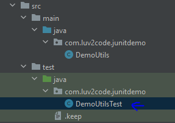
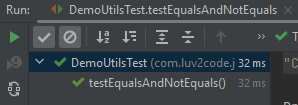
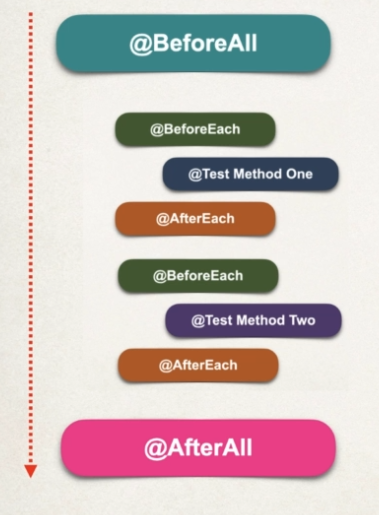
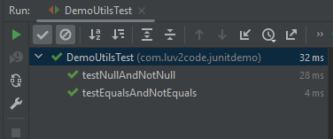
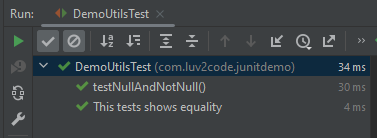

<link href="style.css" rel="stylesheet"></link>

# 🟪 Spring Boot Unit Testing with JUnit, Mockito and MockMvc

* These are my notes while working through Chad Darby's Udemy course on unit testing with the spring framework! 😊

* I started this course on 15/04/2023 📅

* You can find the course [here](https://www.udemy.com/course/spring-boot-unit-testing)

<br>
<hr>

# 🟪 Section 1 - Introduction

## 🟦 Course Introduction

* Spring Boot supports unit test and integration testing vvia JUnit and Mockito

* This course will show you how to take advantage of testing support in Spring

* The course road map consists of:

    1) JUnit Review

    2) Spriong Boot Mocks with Mockito

    3) Spring Boot Testing Spring MVC Web App

    4) Spring Boot Testing Spring REST APIs

## 🟦 Setting up Dev environment

* Dev environment will be intelliJ for Maven support, and MySQL Database Server and Workbench

* I downloaded and installed the MySQL Developer Default setup!

* The source code for this course can be found [here](https://github.com/darbyluv2code/spring-boot-unit-testing)

<br>
<hr>

# 🟪 Section 2 - Unit Testing

## 🟦 2.1 Unit Testing Overview

### 🟥 How Do We Typically Write Tests?

* Typically we write small programs which test our code and examine the results. The test case is not reproduceable and we are unable to automate the tests


### 🟥 What is Unit Testing?

* 🎃 Unit Testing is testing individual unit of code. We have a fixed input and expected known output 🎃

* Suppose we had a calculator program with an `add(int x, int y)` method

    * We would write tests such as:

    1) Does it work with positive?

    2) Does it work with negatives?

    3) Does it work with zero?

#### 🟧 Benefits of Unit Testing:

* Automated tests✔️ Better Code Design✔️ Fewer bugs and reliability✔️

* We can be confident extending/modifying our code ✔️

* Great for automated build processes ✔️

### 🟥 What is Integration Testing?

* 🎃 Integeration Testing is testing multiple components together as part of a test plan 🎃

* We can determine if units of code can work together ✔️

* We can use mocks and stubbing for integration tests ✔️


### 🟥 Unit Testing Frameworks

1) JUnit:

    * Supports creating test cases
    * Automation of test cases
    * Utilities for setup and tearing down tests

2) Mockito:

    * Used for creating mocks and stubs
    * Minimise dependencies (such as databases)

<br>

## 🟦 2.2 Developing JUnit Tests - Overview + Demo

### 🟥 Introduction

* We shall look at some simple examples for unit testing 🎯

* We will look at fundamentals like defining and running tests, and using assertions 🎯

* Discuss Test-Driven Development 🎯

### 🟥 Development Process:

* We shall create a `DemoUtil` class with a method: `add(int a, int b)`, and write unit tests for it. The development process is:

1) Create a Maven project with JUnit dependency 🎯

2) Create test package, write unit test and run test 🎯

* The Maven dependency is:

```xml
<dependency>
    <groupId>org.junit.jupiter</groupId>
    <artifactId>junit-jupiter</artifactId>
    <version>5.8.2</version>
    <scope>test</scope>
</dependency>
```

* The scope is saying that this is for **testing** only, not for normal execution of the code

* We shall setup a `test` package and follow the convention of matching the package structure of the `main` package

* Unit tests have the following structure:

    1) Setup
    2) Execute
    3) Assert

* We use the `@Test` annotation above the test method.

* We setup by instantiating thr `DemoUtil`, execute the `add()` method and assert the expected result

* We then run the test in the IDE

### 🟥 JUnit Assertions

* `JUnit` has a collection of assertions which are defined in `org.junit.jupiter.api.Assertions`

* The assertion methods include:

1) `assertEquals(expected, actual, optionalReturnMessage)`

2) `assertNotEquals(unexpected, actual, optionalReturnMessage)`

2) `assertNull(actual, optionalReturnMessage)`

4) `assertNotNull(actual, optionalReturnMessage)`


### 🟥 Static Import

* We can import the methods from `Assertions` class statically, so we can call the methods without referencing the class

```java
import static org.junit.jupiter.api.Assertions.*; // imports ALL methods
```

<hr>

###  🖥️⌨️🖱️ Project Setup 🖱️⌨️🖥️

* I download the code repository from [https://github.com/darbyluv2code/spring-boot-unit-testing](https://github.com/darbyluv2code/spring-boot-unit-testing)

* I copy `1.00-starting-project` into [this](/Demos/demo-01-project_setup/) folder

* I open up the [POM](/Demos/demo-1/1.00-starting-project/pom.xml) in intelliJ and see this:

```xml
<?xml version="1.0" encoding="UTF-8"?>
<project xmlns="http://maven.apache.org/POM/4.0.0"
         xmlns:xsi="http://www.w3.org/2001/XMLSchema-instance"
         xsi:schemaLocation="http://maven.apache.org/POM/4.0.0 http://maven.apache.org/xsd/maven-4.0.0.xsd">
    <modelVersion>4.0.0</modelVersion>

    <groupId>com.luv2code</groupId>
    <artifactId>junitdemo</artifactId>
    <version>1.0</version>

    <properties>
        <maven.compiler.source>17</maven.compiler.source>
        <maven.compiler.target>17</maven.compiler.target>
    </properties>

</project>
```

* I add the JUnit dependency using intelliJ's generate button:

```xml
   <dependencies>
        <dependency>
            <groupId>org.junit.jupiter</groupId>
            <artifactId>junit-jupiter</artifactId>
            <version>5.9.2</version>
            <scope>test</scope>
        </dependency>
    </dependencies>
```

<br>

## 🟦 2.3 JUnit Assertions

* I add a new package into the `test` package and the `DemoUtilTest` class:



* I write the test:

```java
    @Test
    void testEqualsAndNotEquals(){
        // setup:
        DemoUtils demoUtils = new DemoUtils();
        // using assertEquals and NotEquals:
        assertEquals(6, demoUtils.add(2,4), "2+4 should equal 6");
        assertNotEquals(6, demoUtils.add(1,9), "1+9 should not be 6");
    }
```

* I run the test and it passes as expected:



* I create a method for checking Nulls:

```java
    @Test
    void testNullAndNotNull() {
        DemoUtils demoUtils = new DemoUtils();

        String str1 = null; String str2 = "luv2code";

        assertNull(demoUtils.checkNull(str1));
        assertNotNull(demoUtils.checkNull(str2));
    }
```

* The test passes as expected!!!


<br>

## 🟦 2.4 Test Lifecycle Methods

### 🟥 Lifecycle Methods

* Some common operations is setting up the environment and cleaning things after tests finish.

* JUnit provides Lifecycle Method Annotations, including:

1) `@BeforeEach` - Method is executed before EACH test method

2) `@AfterEach` - Method to be executrer after EACH test method

3) `@BeforeAll` - Only executed ONCE before all test methods. MUST be static

4) `@AfterAll` - Only executed ONCE after all test methods. MUST be static

### 🟥 Execution Sequence



<hr>

###  🖥️⌨️🖱️ Code Demo 🖱️⌨️🖥️

* I remove the instantiation of the `DemoUtils` class in each test method and setup a class field.

* I use the `@BeforeEach` annotation to write a method which instantiates `DemoUtils`, and write a method with `@AfterEach` which just prints a diagnostic message:

```java
public class DemoUtilsTest {

    // Creating a DemoUtil field
    DemoUtils demoUtils;

    @BeforeEach
    void setUpBefore(){
        demoUtils = new DemoUtils();
        System.out.println("BeforeEach executes before each test method");
    }

    @Test
    void testEqualsAndNotEquals(){
        System.out.println("Running test: testEqualsAndNotEquals");
        // using assertEquals and NotEquals:
        assertEquals(6, demoUtils.add(2,4), "2+4 should equal 6");
        assertNotEquals(6, demoUtils.add(1,9), "1+9 should not be 6");
    }

    @Test
    void testNullAndNotNull() {
        System.out.println("Running test: testNullAndNotNull");
        String str1 = null; String str2 = "luv2code";
        assertNull(demoUtils.checkNull(str1));
        assertNotNull(demoUtils.checkNull(str2));
    }

    @AfterEach
    void tearDownAfterEach(){
        System.out.println("Running @AfterEach");
    }
}
```

* Running the test class, shows the following in console:

```console
BeforeEach executes before each test method
Running test: testNullAndNotNull
Running @AfterEach
BeforeEach executes before each test method
Running test: testEqualsAndNotEquals
Running @AfterEach
```


<br>

## 🟦 2.5 Defining Custom Display Names

### 🟥 Custom Display Names

* The name of the methods show up in the test results

* We can use custom display names to provided descriptive names for each tests

* 🎃 We use `@DisplayName` to make a custom display name 🎃

* We can add this annotation below the `@Test` annotation:

```java
    @Test
    @DisplayName("Null and not null")
    void testNullAndNotNull(){
        // test implementation ....
    }
```

### 🟥 Display Name Generators

* JUnit can create display names for you:

1) `Simple` - removes the () for you

2) `ReplaceUnderscores` - this replaces _ with spaces

3) `IndicativeSentences` - creates name based on test class name and method name

* We can use generators WITHOUT using `@DisplayName` for every method. We can define one main annotation at class level using `@DisplayNameGeneration` (⚠️can not use it on methods!)

#### 🟧 Simple Generator

```java
@DisplayNameGeneration(DisplayNameGenerator.Simple.class)
class DemoUtilsTest {
    //....
}
```

#### 🟧 Replace Underscores Generator

```java
@DisplayNameGeneration(DisplayNameGenerator.ReplaceUnderscores.class)
class DemoUtilsTest {
    // ...
}
```

#### 🟧 Indicatibe Sentences Generatro

```java
@DisplayNameGeneration(DisplayNameGenerator.IndicativeSentences.class)
class DemoUtilsTest {
    // ...
}
```

<hr>

###  🖥️⌨️🖱️ Code Demo 🖱️⌨️🖥️

* I start working on the demo [here](/Demos/demo-02-name_generators/)

* Using the following annotation:

```java
@DisplayNameGeneration(DisplayNameGenerator.Simple.class)
public class DemoUtilsTest {
    // ....
}
```

* This displays:



* I can override the generation at class level:

```java
    @Test
    @DisplayName("This tests shows equality")
    void testEqualsAndNotEquals(){
        System.out.println("Running test: testEqualsAndNotEquals");

        // using assertEquals and NotEquals:
        assertEquals(6, demoUtils.add(2,4), "2+4 should equal 6");
        assertNotEquals(6, demoUtils.add(1,9), "1+9 should not be 6");
    }
```

* This displays:



<br>

## 🟦 2.6 JUnit Assertions - Same/NotSame and True/False

### 🟥 Assert Same and Not Same

* `assertSame()` - asserts that items refer to same object

* `assertNotSame()` - asserts that items do NOT refer to same object


```java
    @Test
    void testSameAndNotSame() {
        String str = "123";
        assertSame(str, "123"); // PASSES!
        assertNotSame(str, new DemoUtilsTest()); // PASSES!
    }
```

### 🟥 Asserts True and False

* `assertTrue` - asserts condition is true

* `assertFalse` - asserts condition is false

```java
    @Test
    void testTrueAndFalse(){
        assertTrue(1==1, "one must equal one!"); // PASSES!
        assertFalse(1>1, "one cannot be greater than one!"); // PASSES
    }
```


## 🟦 H2

### 🟥 H3

#### 🟧 H4 
