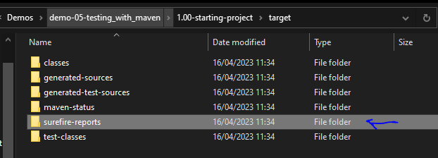

<link href="style.css" rel="stylesheet"></link>

# 🟪 Spring Boot Unit Testing with JUnit, Mockito and MockMvc

* These are my notes while working through Chad Darby's Udemy course on unit testing with the spring framework! 😊

* I started this course on 15/04/2023 📅

* You can find the course [here](https://www.udemy.com/course/spring-boot-unit-testing)

<br>
<hr>

# 🟪 Section 1 - Introduction

## 🟦 Course Introduction

* Spring Boot supports unit test and integration testing vvia JUnit and Mockito

* This course will show you how to take advantage of testing support in Spring

* The course road map consists of:

    1) JUnit Review

    2) Spriong Boot Mocks with Mockito

    3) Spring Boot Testing Spring MVC Web App

    4) Spring Boot Testing Spring REST APIs

## 🟦 Setting up Dev environment

* Dev environment will be intelliJ for Maven support, and MySQL Database Server and Workbench

* I downloaded and installed the MySQL Developer Default setup!

* The source code for this course can be found [here](https://github.com/darbyluv2code/spring-boot-unit-testing)

<br>
<hr>

# 🟪 Section 2 - JUnit Review

## 🟦 2.1 Unit Testing Overview

### 🟥 How Do We Typically Write Tests?

* Typically we write small programs which test our code and examine the results. The test case is not reproduceable and we are unable to automate the tests


### 🟥 What is Unit Testing?

* 🎃 Unit Testing is testing individual unit of code. We have a fixed input and expected known output 🎃

* Suppose we had a calculator program with an `add(int x, int y)` method

    * We would write tests such as:

    1) Does it work with positive?

    2) Does it work with negatives?

    3) Does it work with zero?

#### 🟧 Benefits of Unit Testing:

* Automated tests✔️ Better Code Design✔️ Fewer bugs and reliability✔️

* We can be confident extending/modifying our code ✔️

* Great for automated build processes ✔️

### 🟥 What is Integration Testing?

* 🎃 Integeration Testing is testing multiple components together as part of a test plan 🎃

* We can determine if units of code can work together ✔️

* We can use mocks and stubbing for integration tests ✔️


### 🟥 Unit Testing Frameworks

1) JUnit:

    * Supports creating test cases
    * Automation of test cases
    * Utilities for setup and tearing down tests

2) Mockito:

    * Used for creating mocks and stubs
    * Minimise dependencies (such as databases)

<br>

## 🟦 2.2 Developing JUnit Tests - Overview + Demo

### 🟥 Introduction

* We shall look at some simple examples for unit testing 🎯

* We will look at fundamentals like defining and running tests, and using assertions 🎯

* Discuss Test-Driven Development 🎯

### 🟥 Development Process:

* We shall create a `DemoUtil` class with a method: `add(int a, int b)`, and write unit tests for it. The development process is:

1) Create a Maven project with JUnit dependency 🎯

2) Create test package, write unit test and run test 🎯

* The Maven dependency is:

```xml
<dependency>
    <groupId>org.junit.jupiter</groupId>
    <artifactId>junit-jupiter</artifactId>
    <version>5.8.2</version>
    <scope>test</scope>
</dependency>
```

* The scope is saying that this is for **testing** only, not for normal execution of the code

* We shall setup a `test` package and follow the convention of matching the package structure of the `main` package

* Unit tests have the following structure:

    1) Setup
    2) Execute
    3) Assert

* We use the `@Test` annotation above the test method.

* We setup by instantiating thr `DemoUtil`, execute the `add()` method and assert the expected result

* We then run the test in the IDE

### 🟥 JUnit Assertions

* `JUnit` has a collection of assertions which are defined in `org.junit.jupiter.api.Assertions`

* The assertion methods include:

1) `assertEquals(expected, actual, optionalReturnMessage)`

2) `assertNotEquals(unexpected, actual, optionalReturnMessage)`

2) `assertNull(actual, optionalReturnMessage)`

4) `assertNotNull(actual, optionalReturnMessage)`


### 🟥 Static Import

* We can import the methods from `Assertions` class statically, so we can call the methods without referencing the class

```java
import static org.junit.jupiter.api.Assertions.*; // imports ALL methods
```

<hr>

###  🖥️⌨️🖱️ Project Setup 🖱️⌨️🖥️

* I download the code repository from [https://github.com/darbyluv2code/spring-boot-unit-testing](https://github.com/darbyluv2code/spring-boot-unit-testing)

* I copy `1.00-starting-project` into [this](/Demos/demo-01-project_setup/) folder

* I open up the [POM](/Demos/demo-1/1.00-starting-project/pom.xml) in intelliJ and see this:

```xml
<?xml version="1.0" encoding="UTF-8"?>
<project xmlns="http://maven.apache.org/POM/4.0.0"
         xmlns:xsi="http://www.w3.org/2001/XMLSchema-instance"
         xsi:schemaLocation="http://maven.apache.org/POM/4.0.0 http://maven.apache.org/xsd/maven-4.0.0.xsd">
    <modelVersion>4.0.0</modelVersion>

    <groupId>com.luv2code</groupId>
    <artifactId>junitdemo</artifactId>
    <version>1.0</version>

    <properties>
        <maven.compiler.source>17</maven.compiler.source>
        <maven.compiler.target>17</maven.compiler.target>
    </properties>

</project>
```

* I add the JUnit dependency using intelliJ's generate button:

```xml
   <dependencies>
        <dependency>
            <groupId>org.junit.jupiter</groupId>
            <artifactId>junit-jupiter</artifactId>
            <version>5.9.2</version>
            <scope>test</scope>
        </dependency>
    </dependencies>
```

<br>

## 🟦 2.3 JUnit Assertions

* I add a new package into the `test` package and the `DemoUtilTest` class:


* I write the test:

```java
    @Test
    void testEqualsAndNotEquals(){
        // setup:
        DemoUtils demoUtils = new DemoUtils();
        // using assertEquals and NotEquals:
        assertEquals(6, demoUtils.add(2,4), "2+4 should equal 6");
        assertNotEquals(6, demoUtils.add(1,9), "1+9 should not be 6");
    }
```

* I run the test and it passes as expected:


* I create a method for checking Nulls:

```java
    @Test
    void testNullAndNotNull() {
        DemoUtils demoUtils = new DemoUtils();

        String str1 = null; String str2 = "luv2code";

        assertNull(demoUtils.checkNull(str1));
        assertNotNull(demoUtils.checkNull(str2));
    }
```

* The test passes as expected!!!


<br>

## 🟦 2.4 Test Lifecycle Methods

### 🟥 Lifecycle Methods

* Some common operations is setting up the environment and cleaning things after tests finish.

* JUnit provides Lifecycle Method Annotations, including:

1) `@BeforeEach` - Method is executed before EACH test method

2) `@AfterEach` - Method to be executrer after EACH test method

3) `@BeforeAll` - Only executed ONCE before all test methods. MUST be static

4) `@AfterAll` - Only executed ONCE after all test methods. MUST be static

### 🟥 Execution Sequence


<hr>

###  🖥️⌨️🖱️ Code Demo 🖱️⌨️🖥️

* I remove the instantiation of the `DemoUtils` class in each test method and setup a class field.

* I use the `@BeforeEach` annotation to write a method which instantiates `DemoUtils`, and write a method with `@AfterEach` which just prints a diagnostic message:

```java
public class DemoUtilsTest {

    // Creating a DemoUtil field
    DemoUtils demoUtils;

    @BeforeEach
    void setUpBefore(){
        demoUtils = new DemoUtils();
        System.out.println("BeforeEach executes before each test method");
    }

    @Test
    void testEqualsAndNotEquals(){
        System.out.println("Running test: testEqualsAndNotEquals");
        // using assertEquals and NotEquals:
        assertEquals(6, demoUtils.add(2,4), "2+4 should equal 6");
        assertNotEquals(6, demoUtils.add(1,9), "1+9 should not be 6");
    }

    @Test
    void testNullAndNotNull() {
        System.out.println("Running test: testNullAndNotNull");
        String str1 = null; String str2 = "luv2code";
        assertNull(demoUtils.checkNull(str1));
        assertNotNull(demoUtils.checkNull(str2));
    }

    @AfterEach
    void tearDownAfterEach(){
        System.out.println("Running @AfterEach");
    }
}
```

* Running the test class, shows the following in console:

```console
BeforeEach executes before each test method
Running test: testNullAndNotNull
Running @AfterEach
BeforeEach executes before each test method
Running test: testEqualsAndNotEquals
Running @AfterEach
```


<br>

## 🟦 2.5 Defining Custom Display Names

### 🟥 Custom Display Names

* The name of the methods show up in the test results

* We can use custom display names to provided descriptive names for each tests

* 🎃 We use `@DisplayName` to make a custom display name 🎃

* We can add this annotation below the `@Test` annotation:

```java
    @Test
    @DisplayName("Null and not null")
    void testNullAndNotNull(){
        // test implementation ....
    }
```

### 🟥 Display Name Generators

* JUnit can create display names for you:

1) `Simple` - removes the () for you

2) `ReplaceUnderscores` - this replaces _ with spaces

3) `IndicativeSentences` - creates name based on test class name and method name

* We can use generators WITHOUT using `@DisplayName` for every method. We can define one main annotation at class level using `@DisplayNameGeneration` (⚠️can not use it on methods!)

#### 🟧 Simple Generator

```java
@DisplayNameGeneration(DisplayNameGenerator.Simple.class)
class DemoUtilsTest {
    //....
}
```

#### 🟧 Replace Underscores Generator

```java
@DisplayNameGeneration(DisplayNameGenerator.ReplaceUnderscores.class)
class DemoUtilsTest {
    // ...
}
```

#### 🟧 Indicatibe Sentences Generatro

```java
@DisplayNameGeneration(DisplayNameGenerator.IndicativeSentences.class)
class DemoUtilsTest {
    // ...
}
```

<hr>

###  🖥️⌨️🖱️ Code Demo 🖱️⌨️🖥️

* I start working on the demo [here](/Demos/demo-02-name_generators/)

* Using the following annotation:

```java
@DisplayNameGeneration(DisplayNameGenerator.Simple.class)
public class DemoUtilsTest {
    // ....
}
```

* This displays:


* I can override the generation at class level:

```java
    @Test
    @DisplayName("This tests shows equality")
    void testEqualsAndNotEquals(){
        System.out.println("Running test: testEqualsAndNotEquals");

        // using assertEquals and NotEquals:
        assertEquals(6, demoUtils.add(2,4), "2+4 should equal 6");
        assertNotEquals(6, demoUtils.add(1,9), "1+9 should not be 6");
    }
```

* This displays:


<br>

## 🟦 2.6 JUnit Assertions - Same/NotSame and True/False

### 🟥 Assert Same and Not Same

* `assertSame()` - asserts that items refer to same object

* `assertNotSame()` - asserts that items do NOT refer to same object


```java
    @Test
    void testSameAndNotSame() {
        String str = "123";
        assertSame(str, "123"); // PASSES!
        assertNotSame(str, new DemoUtilsTest()); // PASSES!
    }
```

### 🟥 Asserts True and False

* `assertTrue` - asserts condition is true

* `assertFalse` - asserts condition is false

```java
    @Test
    void testTrueAndFalse(){
        assertTrue(1==1, "one must equal one!"); // PASSES!
        assertFalse(1>1, "one cannot be greater than one!"); // PASSES
    }
```

<br>

## 🟦 2.7 Arrays, Iterable and Lines

### 🟥 assertArrayEquals() Method

* The `assertArrayEquals()` method asserts two object arrays are deeply equal (content is the same)

```java
    @Test
    void arrayIsDeeplyEqual(){
        String[] firstThreeLetters = {"A", "B", "C"};
        assertArrayEquals(firstThreeLetters, new String[] {"A", "B", "C"}); // PASSES!
        assertArrayEquals(firstThreeLetters, new String[] {"A", "C", "B"}); // FAILS!!
    }
```

### 🟥 assertIterableEquals() Method

* The `assertIterableEquals()` method asserts iterable objects are deeply equal! Classes which implement Iterable include LinkedList, ArrayList, HashSet, ...

```java
    @Test
    void iterableIsDeeplyEqual(){
        List<String> list = List.of("Shiv", "Likes", "Java");
        assertIterableEquals(list, List.of("Shiv","Likes", "Java")); // PASSES!
        assertIterableEquals(list, List.of("Shiv","Likes")); // FAILS!
    }
```

### 🟥 assertLinesEquals() Method

* The `assertLinesMatch` asserts that list of Strings match!

```java
    @Test
    void LinesShouldMatch(){
        List<String> list = List.of("Shiv", "Likes", "Java");
        assertLinesMatch(list, List.of("Shiv","Likes","Java")); // PASSES!!
        assertLinesMatch(list, List.of("Shiv","Java","Likes")); // FAILS!!
    }
```

<br>

## 🟦 2.8 Assertion for Throws and Timeouts

### 🟥 Assertion For Throws

* `assertThrows(Class expectedType, Executable executable)` - asserts if an exception is throw in a given lambda

* `assertDoesNotThrow(Executable executable)` - asserts that ANY exception is not thrown


* The `DemoUtils` class has the following method:

```java
public class DemoUtils {
    public String throwException(int a) throws Exception {
        if (a<0)
            throw new Exception("Value should be greater than or equal to 0");
        return "Value is greater than or equal to 0";
    }
}
```

* We can write a test:


```java
    @Test
    void testThrowsAndDoesNotThrow() {
        assertThrows(Exception.class,
                     ()->{ demoUtils.throwException(-1); },
                   "An exception should be thrown"); // PASSES!!

        assertThrows(Exception.class,
                ()-> {throw new RuntimeException();},
                "Should throw Exception class"); // PASSES

        assertThrows(RuntimeException.class,
                ()-> { throw new Exception();},
                "Should throw RuntimeException class"); // FAILS
        

        assertDoesNotThrow(()-> {demoUtils.throwException(1);} ); // PASSES!!

    }
```

### 🟥 Assertion for Timeouts

* `assertTimeOut(Duration stimeout, Executable executable)` - asserts that execution completes before time out is exeeded

* `assertTimeoutPreemptively(Duration timeout, Executable executable)` - again, asserts execution completes before timeout is exceeded, but also aborts execution after timeout

* The `DemoUtils` class has the following method:

```java
public class DemoUtils {
    public void checkTimeOut() throws InterruptedException {
        System.out.println("I am going to sleep");
        Thread.sleep(2000);
        System.out.println("Sleeping over");
    }
}
```

* I write the following test:

```java
    @Test
    void testTimeOutAndTimeOutPremptively(){
        assertTimeout(Duration.ofSeconds(3), ()-> {demoUtils.checkTimeout(); } ); // PASSES!
        /* CONSOLE:
            I am going to sleep
            Sleeping over
         */

        assertTimeout(Duration.ofSeconds(2), ()-> {demoUtils.checkTimeout(); } ); // FAILS!
        /* CONSOLE:
            I am going to sleep
            Sleeping over
            org.opentest4j.AssertionFailedError: execution exceeded timeout of 2000 ms by 6 ms
         */

        assertTimeoutPreemptively(Duration.ofSeconds(1), ()->{demoUtils.checkTimeout();} ); // FAILS!
        /* CONSOLE
            I am going to sleep
            org.opentest4j.AssertionFailedError: execution timed out after 1000 ms
         */

    }
```


<br>

## 🟦 2.9 Ordering JUnit Tests

### 🟥 Introduction

* We can visually change the order of the test report in the IDE. Without any ordering the test results looks like:


* By default, the tests are deterministic but sorted in a pseudo random way intentionally.

* ⚠️In general, ordering should not actually be part of the tests. Unit testing is meant to be independent!⚠️

### 🟥 How to Order Tests

* We can use the `@TestMethodOrder()` annotation to specify ordering.

* We have 4 ways of ordering:

1) `MethodOrderer.DisplayName` sorts test methods alphanumerically using display names

2) `MethodOrderer.MethodName` sorts tests methods alphanumerically using method names

3) `MethodOrderer.Random` sorts test methods randomly!

4) `MethodOrderer.OrderAnnotation` sorts method based on `@Order` annotation

### 🟥 Using @Order

* The `@Order` annotation lets us specify priority of a test using an `int`

* E.g., if we have the following ordering:

```java
@TestMethodOrder(MethodOrderer.OrderAnnotation.class)
@DisplayNameGeneration(DisplayNameGenerator.Simple.class)
public class DemoUtilsTest {

    DemoUtils demoUtils= new DemoUtils();

    @Order(1)
    @Test
    @DisplayName("This tests shows equality")
    void testEqualsAndNotEquals(){
        // ....
    }

    @Order(-33)
    @Test
    void testNullAndNotNull() {
        // ....
    }

    // other tests with no annotation
}
```

* Then the test results look like:


* 💡 The rest of the tests follow the deterministic algorithmic ordering 💡

* 💡 If there are duplicate entries, then it will be ordered using the algorithm forementioned 💡

<br>

## 🟦 2.10 Unit Testing Code Coverage with IntelliJ

### 🟥 Code Coverage

* 💡 Code coverage measures how many of the methods and lines are called via your test 💡

* 🎃 We should strive for 70-80% code coverage, 100% code coverage can be achieved but would not be a meaningful metric 🎃

* IntelliJ has built in support for code coverage! We can also generate reports using Maven in command line

* In order to see the report in intelliJ, you right-click and go to:

    

* We can see the code coverage in the `DemoUtils` class:

    

    * We can see the red lines means not covered and green means code is covered

* We can generate a report by clicking on:

    

* We then get a promp for where to store the report:

    

* If we open up the report, and navigate to the class:

    

    * We can see the `muliply()` method has not been covered, so we could write a test for it

* If we want to generate a test report, we can click on:

    

* Opening the report shows:

    


<br>

## 🟦 2.11 Unit Testing Code Coverage with Maven

### 🟥 Maven

* We can also do Code coverage using Maven in the command line!

* You must have Maven installed (download [here](https://maven.apache.org/download.cgi)) - make sure to download the binary!

### 🟥 Configuring Maven

* 💡 By default Maven will NOT find JUnit 5 tests, we must configure it! We can add Maven Surefire plugin version 2.22.0 or higher. I add the following to the POM:

```xml
<build>
    <plugins>
        <plugin>
            <groupId>org.apache.maven.plugins</groupId>
            <artifaceId>maven-surefire-plugin</artifactId>
            <version>3.0.0-M5</version>
        </plugin>
    </plugins>
</build>
```

### 🟥 Running Unit Tests

* I navigated to my projects source folder ([here](/Demos/demo-05-testing_with_maven/1.00-starting-project/))

* I ran `mvn clean test` and the test ran in the command prompt!:

    

### 🟥 Generating Unit Test Reports

* We can use the SureFire plugin to generate unit test reports! We need to add some information to the `<plugin>` tag:

```xml
<plugin>
    <groupId>org.apache.maven.plugins</groupId>
    <artifactId>maven-surefire-plugin</artifactId>
    <version>3.0.0-M5</version>
    <executions>
        <execution>
            <goals>
                <goal>test</goal>
            </goals>
        </execution>
    </executions>
</plugin>
```

* This saying, during "test" phase execute the "report" goal

* Re-running `mvn clean test`

* The report gets generated here:



* By default, Surefire will not generate reports if test fails. We can add a configuration to the plugin in the POM xml:

```xml
<plugins>
    <plugin>
        <groupId>org.apache.maven.plugins</groupId>
        <artifactId>maven-surefire-plugin</artifactId>
        <version>3.0.0-M5</version>

    </plugin>
    <plugin>
        <groupId>org.apache.maven.plugins</groupId>
        <artifactId>maven-surefire-report-plugin</artifactId>
        <version>3.0.0-M5</version>
        <executions>
            <execution>
                <phase>test</phase>
                <goals>
                    <goal>report</goal>
                </goals>
            </execution>
        </executions>
    </plugin>
</plugins>
```

* If we run `mvn clean test` then we get reports with no stylings:

    

* We need to execute another command, to allow for the css and images: `mvn site -DgenerateRerports=false`

* Our report is now styled:

    

* We need to enable the report to be generated WHEN tests FAIL! We need to add a configuration:

```xml
<plugins>
    <plugin>
        <groupId>org.apache.maven.plugins</groupId>
        <artifactId>maven-surefire-plugin</artifactId>
        <version>3.0.0-M5</version>
        <configuration>
            <testFailureIgnore>true</testFailureIgnore>
        </configuration>
    </plugin>
    <plugin>
        <groupId>org.apache.maven.plugins</groupId>
        <artifactId>maven-surefire-report-plugin</artifactId>
        <version>3.0.0-M5</version>
        <executions>
            <execution>
                <phase>test</phase>
                <goals>
                    <goal>report</goal>
                </goals>
            </execution>
        </executions>
    </plugin>
</plugins>
```

* I'll add a failing test and rerun `mvn clean install` and `mvn site -DgenerateReports=false`

```java
    @Test
    void purposlyFailingTest(){
        assertTrue(false);
    }
```

* And the report generates🎉:

    

* We also need to configure the reports to show the Display names!!! I search the maven repo wiki and find: [this](https://maven.apache.org/surefire/maven-surefire-plugin/examples/junit-platform.html#surefire-extensions-and-reports-configuration-for-displayname):

* I update the POM:

```xml
 <plugin>
    <groupId>org.apache.maven.plugins</groupId>
    <artifactId>maven-surefire-plugin</artifactId>
    <version>3.0.0-M5</version>
    <configuration>
        <testFailureIgnore>true</testFailureIgnore>

        <statelessTestsetReporter implementation="org.apache.maven.plugin.surefire.extensions.junit5.JUnit5Xml30StatelessReporter">
            <usePhrasedFileName>false</usePhrasedFileName>
            <usePhrasedTestSuiteClassName>true</usePhrasedTestSuiteClassName>
            <usePhrasedTestCaseClassName>true</usePhrasedTestCaseClassName>
            <usePhrasedTestCaseMethodName>true</usePhrasedTestCaseMethodName>
        </statelessTestsetReporter>
        <consoleOutputReporter implementation="org.apache.maven.plugin.surefire.extensions.junit5.JUnit5ConsoleOutputReporter">
            <disable>false</disable>
            <encoding>UTF-8</encoding>
            <usePhrasedFileName>false</usePhrasedFileName>
        </consoleOutputReporter>
        <statelessTestsetInfoReporter implementation="org.apache.maven.plugin.surefire.extensions.junit5.JUnit5StatelessTestsetInfoReporter">
            <disable>false</disable>
            <usePhrasedFileName>false</usePhrasedFileName>
            <usePhrasedClassNameInRunning>true</usePhrasedClassNameInRunning>
            <usePhrasedClassNameInTestCaseSummary>true</usePhrasedClassNameInTestCaseSummary>
        </statelessTestsetInfoReporter>
    </configuration>
</plugin>
```

* Now the report shows display names:

    

### 🟥 Generating Code Coverage Reports

* We need another pluging:

```xml
 <plugin>
    <groupId>org.jacoco</groupId>
    <artifactId>jacoco-maven-plugin</artifactId>
    <version>0.8.7</version>

    <executions>
        <execution>
            <id>jacoco-prepare</id>
            <goals>
                <goal>prepare-agent</goal>
            </goals>
        </execution>
        <execution>
            <id>jacoco-report</id>
            <phase>test</phase>
            <goals>
                <goal>report</goal>
            </goals>
        </execution>
    </executions>
</plugin>
```

* We now run `mvn clean test` and the code generate report is created:


    


<br>

## 🟦 2.12 Conditional Tests

### 🟥 Why?

* We may want to disable a given test, or have a test which only runs on specific versions of Java, or or run on a specific OS.

### 🟥 Annotations - Disabled and EnabledOnOS

* `@Disabled` - the test will not be executed but STILL show in the test reports.

* `@EnabledOnOs` - we can specify an OS, or multiple OS's in an array

```java
@Test
@Disabled("Do not run till issue fixed")
void someIgnoredTest() { /* ... */}

@Test
@EnabledOnOs(OS.MAC)
void testOnlyOnMAC() { /* ... */}

@Test
@EnabledOnOs({OS.WINDOWS, OS.MAC})
void testOnlyOnWindowsOrMAC() { /* ... */}
```

    


### 🟥 Annotations - EnabledOnJre and EnabledOnJreRange

* We can disable/enable a test for a particular JRE or range:

```java
    @Test
    @EnabledOnJre(JRE.JAVA_17)
    @Order(10)
    void testOnlyForJRE17(){ } 

    @Test
    @Order(11)
    @EnabledForJreRange(min = JRE.JAVA_17)
    void testForAnythingAbove16() { } 

    @Test
    @Order(12)
    @DisabledForJreRange(max = JRE.JAVA_17)
    void testDisabledForAnyJREBelow18(){} // DOES NOT RUN
```

* The Result is:

    

### 🟥 Annotations - EnabledIfSystemProperty and EnabledIfEnvironmentVariable

* We can enable/disable tests depending on system properties or environment variable

```java
    @Test
    @Order(13)
    @EnabledIfEnvironmentVariable(named = "MAVEN_HOME", matches = "C:\\\\apache-maven-3.6.3")
    void testShouldBeExecuted(){}

    @Test
    @Order(14)
    @EnabledIfEnvironmentVariable(named = "MAVEN_HOME", matches = "hello world")
    void testShouldNotBeExecuted() {}
```

* This displays:

    

## 🟦 H2

### 🟥 H3

#### 🟧 H4 
